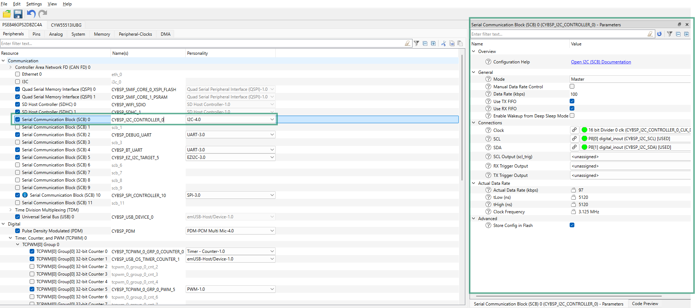

# FT5406 capacitive touch panel driver library for ModusToolbox&trade;

## Overview

This library provides basic set of functions to support Capacitive Touch Panel (CTP) of Waveshare 4.3 inch DSI display driven by [FT5406](https://www.displayfuture.com/Display/datasheet/controller/FT5x06.pdf) CTP controller. This Waveshare 800 x 480 pixel 4.3 inch video mode display panel is used with PSOC&trade; Edge E8x kits.

## Quick start

Follow these steps to add the driver in an application for PSOC&trade; Edge E8x Kit.

1. Create a [PSOC&trade; Edge MCU: Empty application](https://github.com/Infineon/mtb-example-psoc-edge-empty-app) by following "Create a new application" section in [AN235935 – Getting started with PSOC&trade; Edge E8 on ModusToolbox&trade; software](https://www.infineon.com/AN235935) application note

2. Add the *touch-ctp-ft5406* library to this application using Library Manager

3. Use Device Configurator to configure Serial Communication Block (SCB) as an I2C interface for touch driver in the application as follows:

   - Enable Serial Communication Block (SCB) resource and configure the same for FT5406 as shown in **Figure 1**
      
     **Figure 1. SCB I2C controller configuration**
      
     

4. Save the modified configuration(s) in Device Configurator

    > **Note:** The touch controller supports I2C at 100 kHz only

5. Use the driver APIs in the application as shown in the following code snippet:

    ```cpp
    #include "cybsp.h"
    #include "mtb_ctp_ft5406.h"


    /*****************************************************************************
    * Global variable(s)
    *****************************************************************************/
    cy_stc_scb_i2c_context_t i2c_controller_context;

    /* SCB - I2C IRQ configuration. */
    cy_stc_sysint_t i2c_scb_irq_cfg =
    {
        .intrSrc        = CYBSP_I2C_CONTROLLER_IRQ,
        .intrPriority   = 2U
    };

    /* FT5406 touch controller configuration. */
    mtb_ctp_ft5406_config_t ft5406_config =
    {
        .i2c_base       = CYBSP_I2C_CONTROLLER_HW,
        .i2c_context    = &i2c_controller_context
    };


    /*****************************************************************************
    * Function name: i2c_interrupt_callback
    *****************************************************************************/
    void i2c_interrupt_callback(void)
    {
        Cy_SCB_I2C_Interrupt(CYBSP_I2C_CONTROLLER_HW, &i2c_controller_context);
    }


    /*****************************************************************************
    * Function name: main
    *****************************************************************************/
    int main(void)
    {
        cy_rslt_t result;
        cy_en_scb_i2c_status_t i2c_status;

        /* Initializes the device and board peripherals. */
        result = cybsp_init();
        if (CY_RSLT_SUCCESS != result)
        {
            CY_ASSERT(0);
        }

        /* Enables global interrupts. */
        __enable_irq();

        /* Initializes SCB0 as I2C controller.
        * Note that SCB0 has to be configured as an I2C controller operating at 100 kHz 
        * using Device Configurator for the application.
        * Also, the same I2C instance is used for display panel initialization so it 
        * needs to be configured and enabled only once before using the driver 
        * APIs.
        */
        i2c_status = Cy_SCB_I2C_Init(CYBSP_I2C_CONTROLLER_HW, &CYBSP_I2C_CONTROLLER_config, &i2c_controller_context);

        if (CY_SCB_I2C_SUCCESS != i2c_status)
        {
            /* Handles possible errors. */
            CY_ASSERT(0);
        }

        /* Interrupts initialization for SCB block. */
        Cy_SysInt_Init(&i2c_scb_irq_cfg, &i2c_interrupt_callback);
        NVIC_EnableIRQ(i2c_scb_irq_cfg.intrSrc);

        /* Enables I2C. */
        Cy_SCB_I2C_Enable(CYBSP_I2C_CONTROLLER_HW);

        /* Initializes FT5406 touch driver. */
        i2c_status = mtb_ctp_ft5406_init(&ft5406_config);
        if (CY_SCB_I2C_SUCCESS != i2c_status)
        {
            /* Handles possible errors. */
            CY_ASSERT(0);
        }

        for (;;)
        {
        }
    }
    ```
    ```cpp
    cy_en_scb_i2c_status_t i2c_status;
    static int touch_x = 0;
    static int touch_y = 0;
    mtb_ctp_touch_event_t touch_event;

    /* Reads the touch coordinates when a touch event is detected.
    * Invokes this function within the input device read callback registered to
    * the graphics framework or as a callback for the touch interrupt in 
    * a bare metal application.
    */

    /* Reads the touch coordinates and takes an action based on the UI event. */
    i2c_result = mtb_ctp_ft5406_get_single_touch(&touch_event, &touch_x, &touch_y);

    if (CY_SCB_I2C_SUCCESS != i2c_result)
    {
        /* Handles possible errors. */
        CY_ASSERT(0);
    }
    ```
    ```cpp
    /* FT5406 supports multitouch to gather multitouch data, call 
    * the following API:
    */
    int touch_count;
    mtb_ctp_multi_touch_point_t touch_array[MTB_CTP_FT5406_MAX_TOUCHES] = {0xff};
    i2c_result = mtb_ctp_ft5406_get_multi_touch(&touch_count, touch_array);

    if (CY_SCB_I2C_SUCCESS != i2c_result)
    {
        /* Handles possible errors. */
        CY_ASSERT(0);
    }
    ```
    > **Note:** To enable graphics support with the Waveshare 4.3 inch display, follow steps outlined in the **Quick start** section of the *display-dsi-waveshare-4-3-lcd* **README** file.

## More information

For more information, see the following documents:

* [API reference guide](./API_reference.md)
* [ModusToolbox&trade; software environment, quick start guide, documentation, and videos](https://www.infineon.com/modustoolbox)
* [AN239191](https://www.infineon.com/AN239191) – Getting started with graphics on PSOC&trade; Edge MCU
* [Infineon Technologies AG](https://www.infineon.com)


---
© 2025, Cypress Semiconductor Corporation (an Infineon company)
